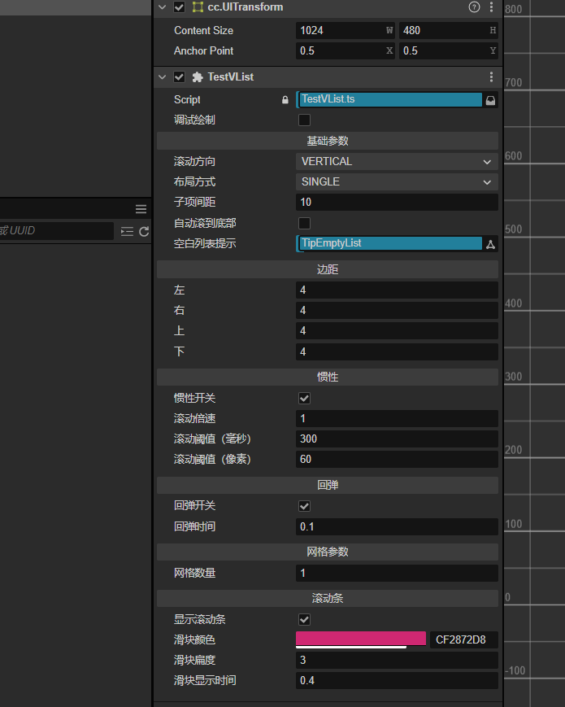
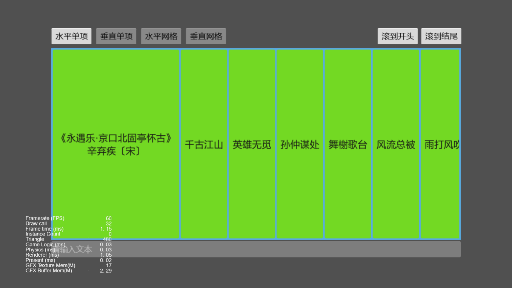
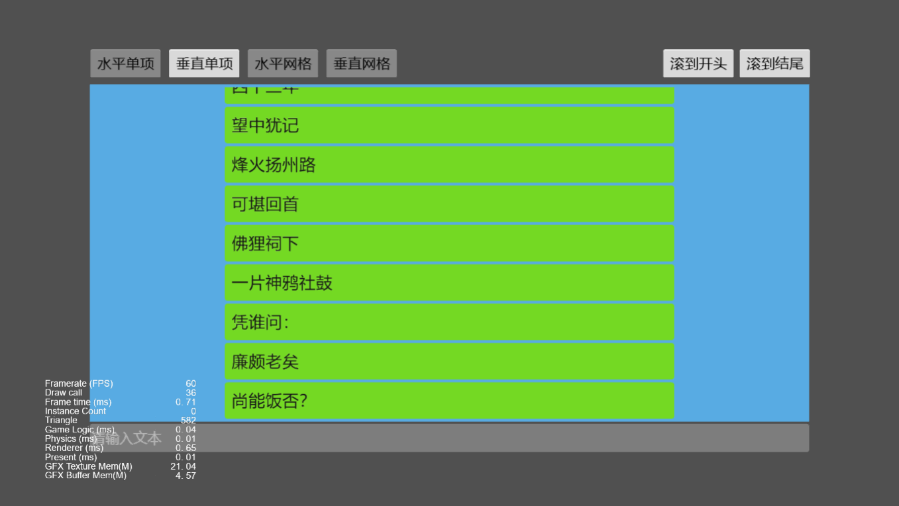
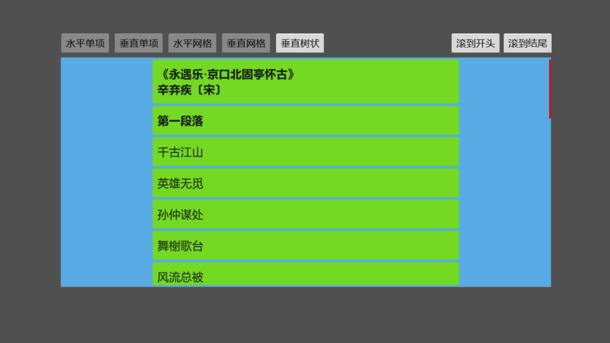
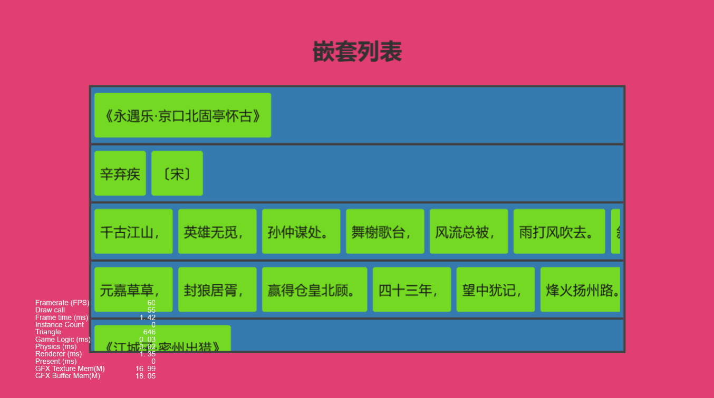
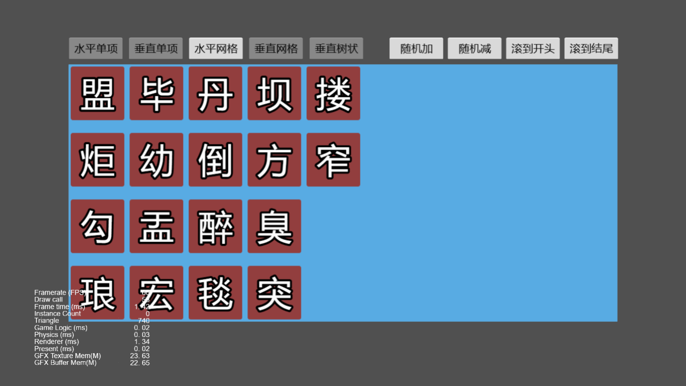

# 从零开始撸一个虚拟列表

## 支持功能

-   支持视区裁剪，即只有可视范围内的子项会被创建并渲染（可以有效降低内存和 DC）
-   支持使用鼠标滚轮滚动
-   支持在单项布局中动态调整子项尺寸
-   支持在单项布局中折叠子项（由此可以由开发者自行定义树形结构并扩展出树形列表）
-   支持从开始位置、结束位置、指定索引处插入、删除子项
-   支持滚动到开始位置、结束位置、指定项位置
-   支持在更新列表时自动滚动到底部（在聊天这种场景下非常有用）
-   支持惯性滚动，并配置开关
-   支持超出滚动范围时回弹，并配置开关
-   支持添加滚动条，自定义滚动条样式
-   支持空白列表提示
-   支持嵌套列表

## 属性面板

### 案例演示

-   水平滚动单项布局列表
    
-   垂直滚动单项布局列表
    
-   水平滚动网格布局列表
    
-   垂直滚动网格布局列表
    
-   **2024.12.20** 新增树形列表支持
    
-   **2024.12.22** 新增嵌套列表支持
    
-   **2024.12.22** 新增空白列表提示支持
    
